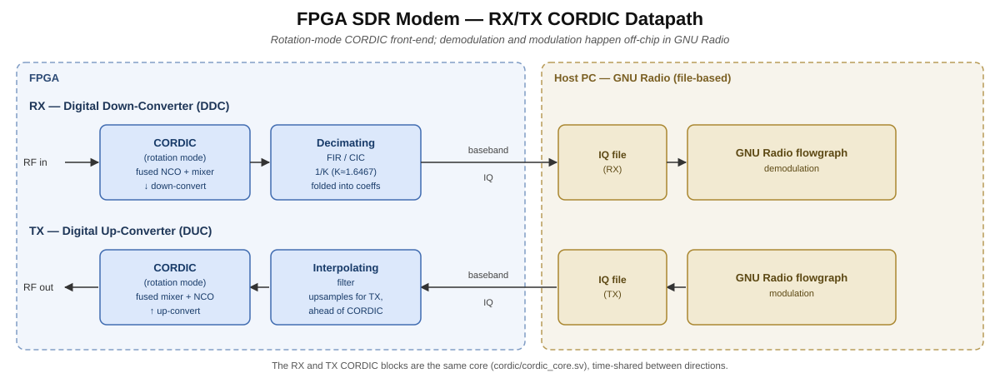

# FPGA SDR Modem

An FPGA-based SDR modem built around a folded CORDIC front-end.

**Architecture.** The receive side is a digital down-converter (DDC): a rotation-mode
CORDIC combines the NCO and mixer into one block, down-converting the RF input to
baseband, followed by a decimating CIC/FIR chain producing baseband IQ. The same CORDIC
core runs in reverse as an up-converter (DUC) with an interpolating filter, so RX and TX
share one front-end.

**Demod/mod split.** Demodulation and modulation happen off the FPGA, in GNU Radio, via a
file-based flowgraph. The FPGA's job is only the rate-critical front-end; baseband IQ is
handed off to GNU Radio for the actual demod/mod work.

## Components

- **CORDIC (rotation mode)** — the shared engine behind both directions: fused NCO +
  mixer for down-conversion on RX, run in reverse for up-conversion on TX.
- **Decimating FIR/CIC** — the RX-side filter, with the CORDIC gain K ≈ 1.6467 folded
  into its coefficients rather than spent on a separate scaling stage.
- **Interpolating filter** — the TX-side counterpart, upsampling ahead of the CORDIC.
- **GNU Radio** — off-chip, file-based, handles demodulation and modulation.

## Verification

The numpy reference model is `cordic/reference/ddc_reference.py`, with 30 tests in
`cordic/reference/test_ddc_reference.py` (`python cordic/reference/test_ddc_reference.py`).

It is two models in one file. `ddc_ideal()` is float64, exact: what the answer should be.
`DDC.run()` is bit-exact fixed point: what the RTL must produce. RTL is checked against
the fixed-point model bit for bit, with no tolerance to hide in. The fixed-point model is
checked against the ideal one in SNR/SFDR, which is a question of whether the chosen
widths are good enough, not a correctness question.

`--emit-vectors build/ddc_vectors` writes `$readmemh`-ready hex for the stimulus and
every intermediate stage (NCO, mixer, output), plus a generated `ddc_params.svh` so the
RTL is parameterised from the same numbers. The testbench reads these values rather than
recomputing the reference, so a sign error shared by both implementations cannot hide.

Measured at the default 16-bit config (`--report`):

| | SNR | SFDR | ENOB |
|---|---|---|---|
| NCO alone | 91.6 dB | 93.3 dB | — |
| DDC (fused mixer) | 79.2 dB | 82.8 dB | 12.86 |

### Design facts from the reference model

The fused mixer's output is K·x·e^(−jθ) with K > 1, so a full-scale input overflows a
same-width output — the datapath carries one extra bit to absorb it. The signal itself
carries the K, with no free CORDIC seed value to fold it into, so the 1/K correction lives
in the FIR/interpolator coefficients instead.

Only fully-loaded filter outputs are real outputs. Hardware never produces the `n_taps-1`
tail samples where a filter runs off the end of its input buffer, so the model uses
valid-only convolution to match.

### NCO widths: M = 32, N = 14

Three separate numbers, and conflating them loses information:

- **M = 32** (`phase_bits`) — accumulator width. Sets frequency resolution, fs/2^M =
  0.56 mHz at 2.4 MS/s. Any LO is placed essentially exactly.
- **N = 14** (`phase_trunc_bits`) — phase bits reaching the angle path. Sets spectral
  purity. Truncating M→N discards information every sample, and the error is periodic, so
  it shows up as discrete spurs: worst-case bound ~6.02·N = 84 dBc. Nothing downstream
  buys past it.
- **`ang_bits` = 18** — the CORDIC's internal angle register, wider than N with the
  truncated phase zero-padded into it, so the rotation converges on the truncated angle
  instead of quantising it a second time. Using N as the z width too would cap useful
  iterations at 13, since past that the atan entries round to zero.
